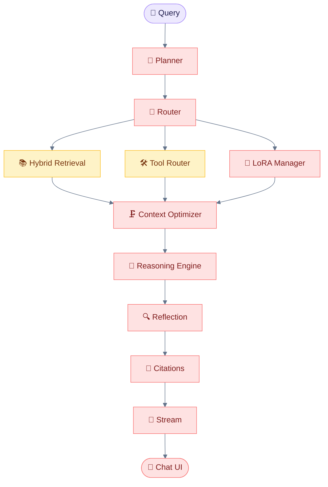

#  LoRA Orchestration Engine

*Self-orchestrating AI backend*

---

```mermaid
%%{init: {'theme':'base', 'themeVariables': {
  'primaryColor':'#ede9fe','primaryBorderColor':'#a78bfa','primaryTextColor':'#1e1b4b',
  'lineColor':'#64748b','fontFamily':'Verdana'
}}}%%
flowchart TB
    U(["👤 Query"]) --> P["🧭 Planner"] --> R["🔀 Router"]
    R --> H["📚 Hybrid Retrieval"]
    R --> T["🛠️ Tool Router"]
    R --> L["🧩 LoRA Manager"]
    H --> C["🗜️ Context Optimizer"]
    T --> C
    L --> C
    C --> G["🤖 Reasoning Engine"]
    G --> RF["🔍 Reflection"] --> CI["🔗 Citations"] --> S["📡 Stream"] --> F(["💬 Chat UI"])

    classDef done fill:#dcfce7,stroke:#4ade80,color:#14532d;
    classDef progress fill:#fef3c7,stroke:#fbbf24,color:#78350f;
    classDef pending fill:#fee2e2,stroke:#f87171,color:#7f1d1d;
    class H,T progress
    class L,C,P,R,G,RF,CI,S,F pending
```

